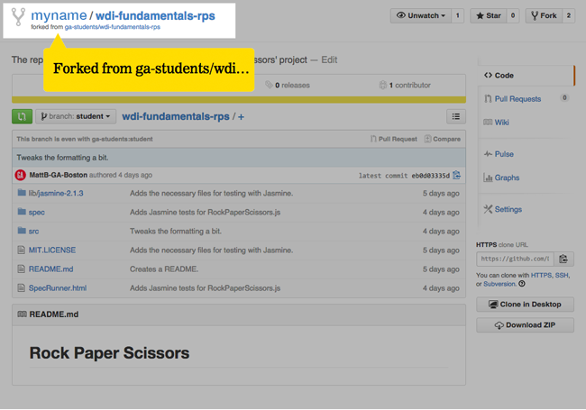
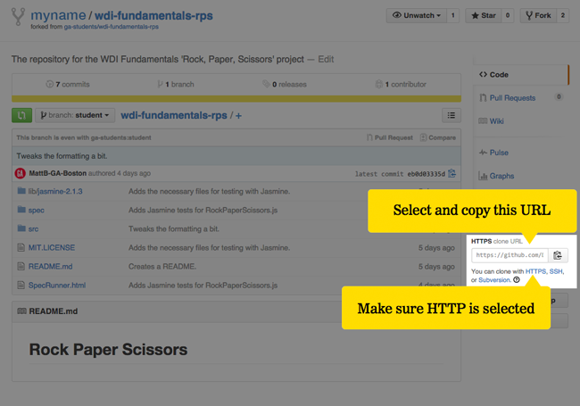

**WDI Fundamentals - Unit 2**

---

## Your Turn
 
As you move through the next few chapters, you will be charged with working on a project as your final assignment from WDI Fundamentals. Each chapter will introduce you to new tools and ideas, but it will be your job to figure out how to incorporate and use them to complete the assignment.

- - -

**Title:** Rock, Paper, Scissors App

**Description:** You will be building an application in JavaScript capable of playing the game 'Rock, Paper, Scissors' with a user via a console or terminal. In particular, your app will need to:
* Accept a move from a player.
* Get a random move from the computer.
* Compare the player's move to the computer's move in order to determine a winner.
* Keep track of how many times the player and the computer have won.
* Run until either the player or the computer has won five times.

The first two bullets have largely been taken care of for you via the code we'll provide you. Feel free to read through it, but (for now) please don't change it - doing so may cause problems with your project.

To access the existing code for this project, you will need to fork and clone the repository that contains it. To do this, take the following steps.

1. If you don't have one already, [create an account](07_exercise.md) on GitHub.com.

2. Go to [this address](https://github.com/ga-students/wdi-fundamentals-rps) to find the repository containing the existing code.
	Once there, click the button that says 'Fork' - this will create a copy of the original repository under **your** GitHub account.

3. Go take a look and confirm that you now have a copy of `wdi-fundamentals-rps` in your list of repositories.

4. Open your fork of the repo (and note that Github lists your repo as a fork of the original).

	

5. Find the Clone URL listed on this page and copy it to your clipboard.

	

6. Open up the terminal application on your computer, and navigate to the `fundamentals` directory within your home directory.
	Once there, run the following Git command from command line:
 
`git clone https://your/clone/url` (substituting the clone URL you copied above)
 
	This will copy your forked repo from GitHub to your own computer, so that you can work on it.

7. If you have followed these directions correctly, you should now have a repository in your `fundamentals` folder called `wdi-fundamentals-rps`. This repository contains three folders and a couple of other files.  The ONLY file we're expecting you to edit for this project is `rockpaperscissors.js` - it can be found at `wdi-fundamentals-rps/app/js/rockpaperscissors.js`. 

---

That's it for now! We'll be coming back to this project at the end of every chapter, but for now, it's time to [move on to Chapter 3](../03_chapter/intro.md).
